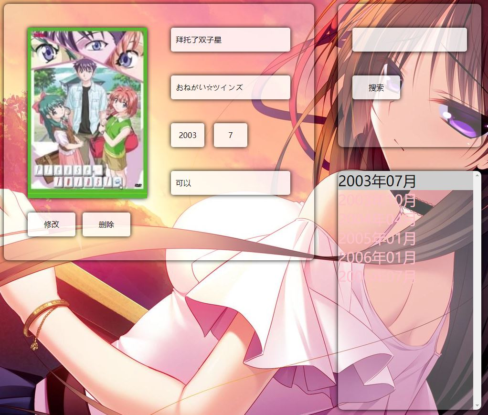
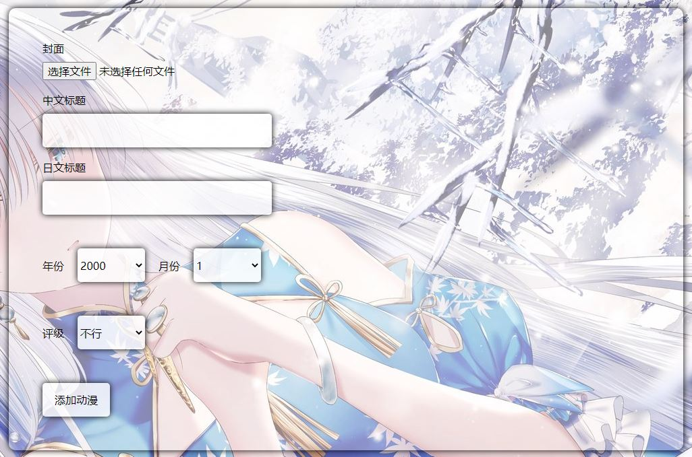
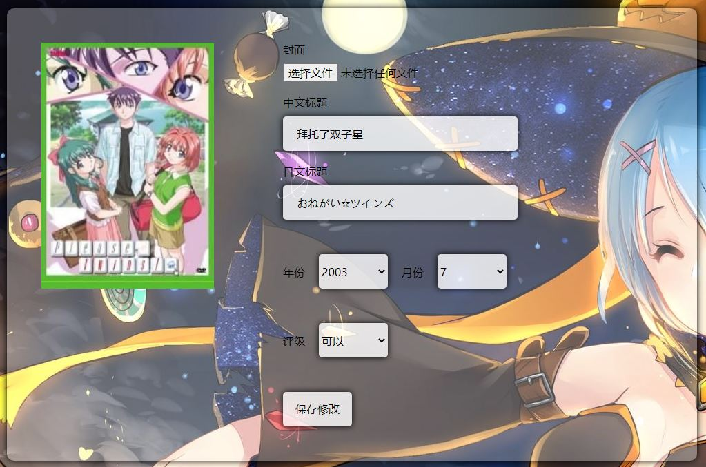
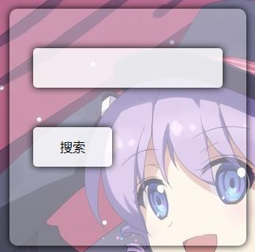
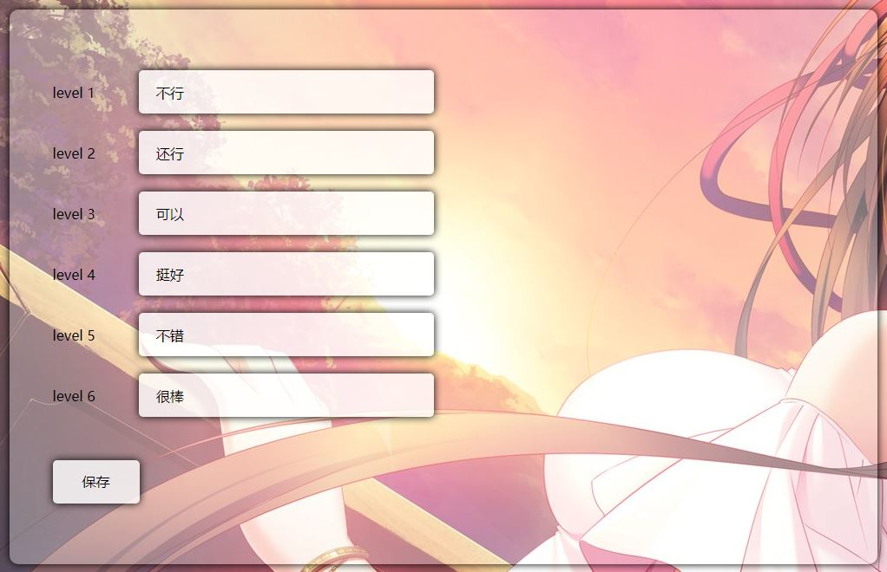

# 动漫

## 查看动漫



```
<asp:Literal ID="ltlMsg" runat="server"></asp:Literal>
<div id="anime-left">
    <asp:Repeater ID="rptAnime" runat="server">
        <ItemTemplate>
            <div class="anime-info bg-box">
                <div class="anime-info-left">
                    <div class="anime-page button"><asp:Image ID="imgPage" runat="server" Width="250" Height="357" ImageUrl=<%#Eval("Image")%> /></div>
                    <div class="anime-btn">
                        <asp:Button ID="btnEdit" runat="server" Text="修改" CssClass="button" CommandArgument=<%#Eval("Title")%> OnClick="BtnEdit_Click" />
                        <asp:Button ID="btnDel" runat="server" Text="删除" CssClass="button" CommandArgument=<%#Eval("Title")%> OnClick="BtnDel_Click" OnClientClick="return check('确认删除吗？');" />
                    </div>                    </div>
                <div class="anime-info-right">
                    <div class="anime-text textbox"><%#Eval("Title")%></div>
                    <div class="anime-text textbox"><%#Eval("Origin")%></div>
                    <div class="anime-time">
                        <div class="textbox"><%#Eval("Year")%></div>
                        <div class="textbox"><%#Eval("Month")%></div>
                        <span class="clear"></span>
                    </div>
                    <div class="anime-text textbox"><%#Eval("Depict")%></div>
                </div>
                <div class="clear"></div>
            </div>
        </ItemTemplate>
    </asp:Repeater>
</div>
<div id="anime-right">
    <div id="anime-search" class="bg-box">
        <asp:TextBox ID="txtSearch" runat="server" CssClass="textbox"></asp:TextBox>
        <asp:Button ID="btnSearch" runat="server" Text="搜索" CssClass="button" OnClick="BtnSearch_Click" />
    </div>
    <div id="anime-select" class="bg-box">
        <asp:ListBox ID="lstDate" runat="server" AutoPostBack="True" OnSelectedIndexChanged="LstDate_SelectedIndexChanged"></asp:ListBox>
    </div>
</div>

protected void Page_Load(object sender, EventArgs e)
{
    if (!IsPostBack)
    {
        List<DateTime> dates = new AnimeService().GetSeason();
        for (int i = 0; i < dates.Count; i++)
            lstDate.Items.Add(dates[i].ToString("yyyy年MM月"));
        if (lstDate.Items.Count > 0)
        {
            lstDate.Items[0].Selected = true;
            LstDate_SelectedIndexChanged(null, null);
        }
    }
    ltlMsg.Text = "";
}

protected void LstDate_SelectedIndexChanged(object sender, EventArgs e)
{
    DateTime date = Convert.ToDateTime(lstDate.SelectedValue);
    rptAnime.DataSource = new AnimeService().GetAnimesByDate(date);
    rptAnime.DataBind();
}

protected void BtnEdit_Click(object sender, EventArgs e)
{
    string title = ((Button)sender).CommandArgument;
    Response.Redirect("~/Anime/SetAnime.aspx?title=" + HttpUtility.UrlEncode(title));
}

protected void BtnDel_Click(object sender, EventArgs e)
{
    string title = ((Button)sender).CommandArgument;
    bool result = new AnimeService().DelAnime(title);
    if (result)
        ltlMsg.Text = "<script>alert('删除成功')</script>";
    else
        ltlMsg.Text = "<script>alert('删除异常')</script>";
    List<DateTime> dates = new AnimeService().GetSeason();
    int index = lstDate.SelectedIndex;
    lstDate.Items.Clear();
    for (int i = 0; i < dates.Count; i++)
        lstDate.Items.Add(dates[i].ToString("yyyy年MM月"));
    if (dates.Count == 0)
    {
        rptAnime.DataSource = null;
        rptAnime.DataBind();
        return;
    }
    if (index > dates.Count - 1)
        index--;
    lstDate.Items[index].Selected = true;
    LstDate_SelectedIndexChanged(null, null);
}
```

## 添加动漫



```
<asp:Literal ID="ltlMsg" runat="server"></asp:Literal>
<div id="add-anime-box" class="bg-box">
    <div id="anime-page">
        <asp:Image ID="imgPage" Width="250" Height="357" runat="server" />
    </div>
    <div id="anime-info">
        <div id="add-anime-page">封面<br /><asp:FileUpload ID="fupPage" runat="server" /></div>
        <div id="add-anime-title">中文标题<br /><asp:TextBox ID="txtTitle" CssClass="textbox" runat="server"></asp:TextBox></div>
        <div id="add-anime-origin">日文标题<br /><asp:TextBox ID="txtOrigin" CssClass="textbox" runat="server"></asp:TextBox></div>
        <div id="add-anime-time">
            <div>年份<asp:DropDownList ID="dropYear" CssClass="button" runat="server"></asp:DropDownList></div>
            <div>月份<asp:DropDownList ID="dropMonth" CssClass="button" runat="server"></asp:DropDownList></div>
            <span class="clear"></span>
        </div>
        <div id="add-anime-depict">评级<asp:DropDownList ID="dropDepict" CssClass="button" runat="server"></asp:DropDownList></div>
        <div id="add-anime-btn"><asp:Button ID="btnSave" runat="server" CssClass="button" CommandArgument=<%#Eval("Title")%> OnClick="BtnSave_Click"/></div>
    </div>
    <div class="clear"></div>
</div>

protected void Page_Load(object sender, EventArgs e)
{
    if (!IsPostBack)
    {
        for (int i = 2000; i <= DateTime.Now.Year + 2; i++)
            dropYear.Items.Add(i.ToString());
        for (int i = 1; i < 12; i += 3)
            dropMonth.Items.Add(i.ToString());
        List<AnimeGrade> animeExtends = new AnimeService().GetGrades();
        foreach (AnimeGrade animeGrade in animeExtends)
            dropDepict.Items.Add(animeGrade.Depict);
        string title = HttpUtility.UrlDecode(Request.QueryString["title"]);
        if (title == null)
        {
            btnSave.Text = "添加动漫";
            imgPage.Visible = false;
        }
        else
        {
            btnSave.Text = "保存修改";
            AnimeExtend anime = new AnimeService().GetAnimeByTitle(title);
            imgPage.ImageUrl = anime.Image;
            txtTitle.Text = anime.Title;
            txtOrigin.Text = anime.Origin;
            dropYear.SelectedValue = anime.Year.ToString();
            dropMonth.SelectedValue = anime.Month.ToString();
            dropDepict.SelectedValue = anime.Depict;
        }
        if (Request.QueryString["add"] == "1")
        {
            ltlMsg.Text = "<script>alert('添加成功')</script>";
            return;
        }
        if (Request.QueryString["modify"] == "1")
        {
            ltlMsg.Text = "<script>alert('保存成功')</script>";
            return;
        }
    }
    ltlMsg.Text = "";
}

protected void BtnSave_Click(object sender, EventArgs e)
{
    if (Request.QueryString["title"] == null)
        Save();
    else
        Edit();
}

private void Save()
{
    Models.Anime anime = new Models.Anime()
    {
        Title = txtTitle.Text.Trim(),
        Origin = txtOrigin.Text.Trim(),
        Year = Convert.ToInt32(dropYear.SelectedValue),
        Month = Convert.ToInt32(dropMonth.SelectedValue),
        Level = dropDepict.SelectedIndex + 1
    };
    bool success;
    if (fupPage.FileName == "")
        success = new AnimeService().AddAnime(anime, null);
    else
    {
        string[] name = fupPage.FileName.Split('.');
        if (name[name.Length - 1].ToLower() != "jpg")
        {
            ltlMsg.Text = "<script>alert('图片必须jpg')</script>";
            return;
        }
        if (fupPage.FileContent.Length > 1024 * 1024)
        {
            ltlMsg.Text = "<script>alert('不能超过1M')</script>";
            return;
        }
        success = new AnimeService().AddAnime(anime, fupPage.PostedFile.InputStream);
    }
    if (success)
        Response.Redirect("~/Anime/SetAnime.aspx?add=1");
    else
        ltlMsg.Text = "<script>alert('添加异常')</script>";
}
```

## 修改动漫



```
private void Edit()
{
    Models.Anime anime = new Models.Anime()
    {
        Title = txtTitle.Text.Trim(),
        Origin = txtOrigin.Text.Trim(),
        Year = Convert.ToInt32(dropYear.SelectedValue),
        Month = Convert.ToInt32(dropMonth.SelectedValue),
        Level = dropDepict.SelectedIndex + 1
    };
    string oldTitle = HttpUtility.UrlDecode(Request.QueryString["title"]);
    bool success;
    if (fupPage.FileName == "")
        success = new AnimeService().UpdateAnime(anime, oldTitle);
    else
    {
        string[] name = fupPage.FileName.Split('.');
        if (name[name.Length - 1].ToLower() != "jpg")
        {
            ltlMsg.Text = "<script>alert('图片必须jpg')</script>";
            return;
        }
        if (fupPage.FileContent.Length > 1024 * 1024)
        {
            ltlMsg.Text = "<script>alert('不能超过1M')</script>";
            return;
        }
        success = new AnimeService().UpdateAnime(anime, oldTitle, fupPage.PostedFile.InputStream);
    }
    if (success)
        Response.Redirect(string.Format("~/Anime/SetAnime.aspx?title={0}&modify={1}", HttpUtility.UrlEncode(anime.Title), 1));
    else
        ltlMsg.Text = "<script>alert('保存异常')</script>";
}
```

## 搜索



```
protected void BtnSearch_Click(object sender, EventArgs e)
{
    string name = txtSearch.Text.Trim();
    rptAnime.DataSource = new AnimeService().SearchAnimes(name);
    rptAnime.DataBind();
}
```

## 评级



```
<asp:Literal ID="ltlMsg" runat="server"></asp:Literal>
<div id="grade-box" class="bg-box">
    <div>level 1<asp:TextBox ID="txtOne" runat="server" CssClass="textbox"></asp:TextBox></div>
    <div>level 2<asp:TextBox ID="txtTwo" runat="server" CssClass="textbox"></asp:TextBox></div>
    <div>level 3<asp:TextBox ID="txtThree" runat="server" CssClass="textbox"></asp:TextBox></div>
    <div>level 4<asp:TextBox ID="txtFour" runat="server" CssClass="textbox"></asp:TextBox></div>
    <div>level 5<asp:TextBox ID="txtFive" runat="server" CssClass="textbox"></asp:TextBox></div>
    <div>level 6<asp:TextBox ID="txtSix" runat="server" CssClass="textbox"></asp:TextBox></div>
    <div id="save-btn"><asp:Button ID="btnSave" runat="server" Text="保存" CssClass="button" OnClick="BtnSave_Click" /></div>
</div>

protected void Page_Load(object sender, EventArgs e)
{
    if (!IsPostBack)
    {
        List<TextBox> textBoxes = new List<TextBox> { txtOne, txtTwo, txtThree, txtFour, txtFive, txtSix };
        List<AnimeGrade> grades = new AnimeService().GetGrades();
        foreach (AnimeGrade animeGrade in grades)
            textBoxes[animeGrade.Level - 1].Text = animeGrade.Depict;
    }
    ltlMsg.Text = "";
}

protected void BtnSave_Click(object sender, EventArgs e)
{
    List<AnimeGrade> grades = new List<AnimeGrade>();
    List<TextBox> textBoxes = new List<TextBox> { txtOne, txtTwo, txtThree, txtFour, txtFive, txtSix };
    foreach (TextBox textBox in textBoxes)
        grades.Add(new AnimeGrade()
        {
            Level = textBoxes.IndexOf(textBox) + 1,
            Depict = textBox.Text
        });
    bool result = new AnimeService().SetGrades(grades);
    if (result)
        ltlMsg.Text = "<script>alert('保存成功')</script>";
    else
        ltlMsg.Text = "<script>alert('保存失败')</script>";
}
```
