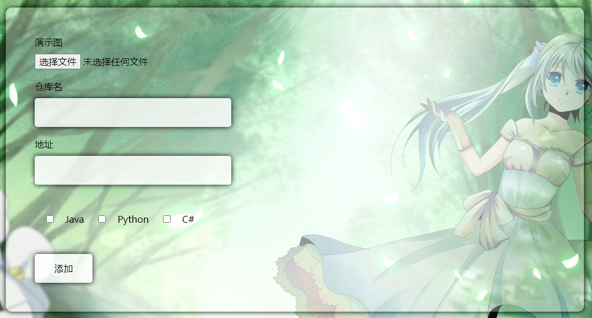
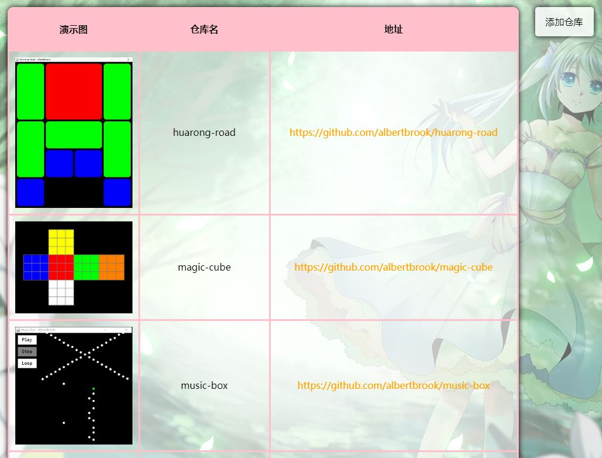

# 代码

## 仓库管理



```
<asp:Literal ID="ltlMsg" runat="server"></asp:Literal>
<div id="add-code-box" class="bg-box">
    <div id="add-code-demo">演示图<br /><asp:FileUpload ID="fupDemo" runat="server" /></div>
    <div id="add-code-repository">仓库名<br /><asp:TextBox ID="txtRepository" CssClass="textbox" runat="server"></asp:TextBox></div>
    <div id="add-code-url">地址<br /><asp:TextBox ID="txtUrl" CssClass="textbox" runat="server"></asp:TextBox></div>
    <div id="add-code-language">
        <asp:CheckBox ID="chkJava" Text="Java" runat="server" />
        <asp:CheckBox ID="chkPython" Text="Python" runat="server" />
        <asp:CheckBox ID="chkCSharp" Text="C#" runat="server" />
    </div>
    <div id="add-anime-btn"><asp:Button ID="btnAdd" Text="添加" runat="server" CssClass="button" OnClick="BtnAdd_Click"/></div>
</div>

protected void Page_Load(object sender, EventArgs e)
{
    if (!IsPostBack)
    {
        if (Request.QueryString["add"] == "1")
        {
            ltlMsg.Text = "<script>alert('添加成功')</script>";
            return;
        }
        if (Request.QueryString["modify"] == "1")
        {
            ltlMsg.Text = "<script>alert('修改成功')</script>";
            return;
        }
    }

    ltlMsg.Text = "";
}

protected void BtnAdd_Click(object sender, EventArgs e)
{
    string language = "";
    CheckBox[] checkBoxes = new CheckBox[3] { chkJava, chkPython, chkCSharp };
    foreach (CheckBox checkBox in checkBoxes)
        if (checkBox.Checked == true)
            language += checkBox.Text + ",";
    language = language.Substring(0, language.Length - 1);
    Models.Code code = new Models.Code()
    {
        Repository = txtRepository.Text,
        Url = txtUrl.Text,
        Language = language
    };
    CodeService codeService = new CodeService();
    bool exist = codeService.IsCodeExist(code.Repository);
    string message = exist ? "modify" : "add";
    bool success;
    if (fupDemo.FileName == "")
    {
        if (exist)
            success = codeService.UpdateCode(code) == 1;
        else
            success = codeService.InsertCode(code, null);
    }
    else
    {
        string[] name = fupDemo.FileName.Split('.');
        if (name[name.Length - 1].ToLower() != "jpg")
        {
            ltlMsg.Text = "<script>alert('图片必须jpg')</script>";
            return;
        }
        if (fupDemo.FileContent.Length > 1024 * 1024)
        {
            ltlMsg.Text = "<script>alert('不能超过1M')</script>";
            return;
        }
        if (exist)
            success = codeService.UpdateCode(code, fupDemo.PostedFile.InputStream);
        else
            success = codeService.InsertCode(code, fupDemo.PostedFile.InputStream);
    }
    if (success)
        Response.Redirect("~/Code/AddRepository.aspx?" + message + "=1");
    else
        ltlMsg.Text = "<script>alert('" + message + "异常')</script>";
}
```

## 查看



```
<asp:Button ID="btnAddRepo" CssClass="button" runat="server" Text="添加仓库" OnClick="BtnAddRepo_Click" />
<asp:GridView ID="gvwCode" CssClass="bg-box" runat="server" AutoGenerateColumns="False" OnRowDataBound="GvwCode_RowDataBound">
    <Columns>
        <asp:TemplateField HeaderText="演示图">
            <ItemTemplate>
                <asp:Image ID="imgDemo" ImageUrl=<%#Eval("Image")%> runat="server" Width="200px" />
            </ItemTemplate>
        </asp:TemplateField>
        <asp:BoundField DataField="Repository" HeaderText="仓库名" >
            <HeaderStyle Width="200px" />
        </asp:BoundField>
        <asp:HyperLinkField DataNavigateUrlFields="Url" HeaderText="地址" DataTextField="Url" >
            <HeaderStyle Width="400px" />
        </asp:HyperLinkField>
    </Columns>
</asp:GridView>

protected void Page_Load(object sender, EventArgs e)
{
    if (!IsPostBack)
    {
        string language = Request.QueryString["language"];
        if (language == null)
            gvwCode.DataSource = new CodeService().GetAllCodes();
        else
            gvwCode.DataSource = new CodeService().GetCodesByLanguage(language);
        gvwCode.DataBind();
    }
}

protected void GvwCode_RowDataBound(object sender, GridViewRowEventArgs e)
{
    if (e.Row.RowType == DataControlRowType.DataRow)
    {
        e.Row.Attributes.Add("onmouseover",
            "a = this.getElementsByTagName('a')[0];" +
            "tmpA = a.style.textShadow;" +
            "a.style.textShadow = '0 0 5px red';" +
            "tmpColor = this.style.backgroundColor;" +
            "this.style.backgroundColor = 'rgba(0, 255, 0, 0.3)'");
        e.Row.Attributes.Add("onmouseout",
            "this.getElementsByTagName('a')[0].style.textShadow = tmpA;" +
            "this.style.backgroundColor = tmpColor;");
    }
}

protected void BtnAddRepo_Click(object sender, EventArgs e)
{
    Response.Redirect("~/Code/AddRepository.aspx");
}
```
