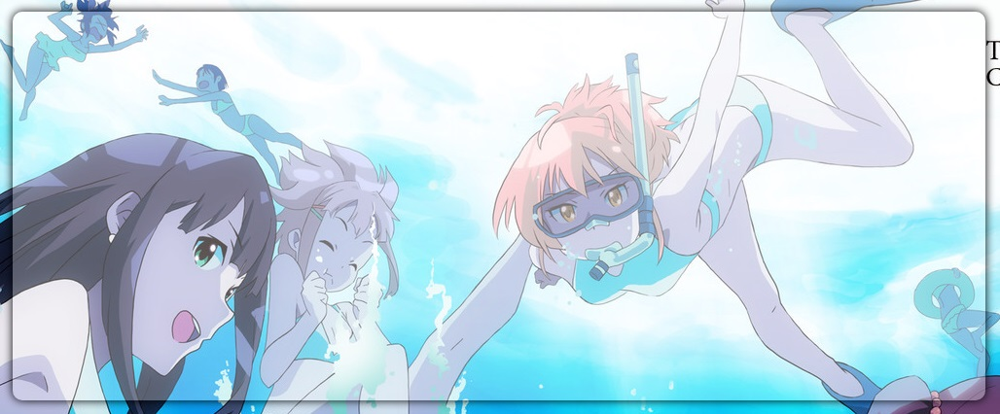
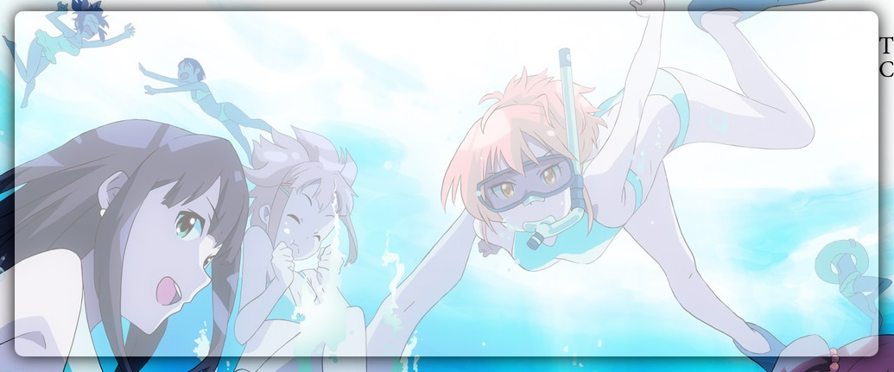
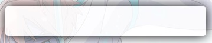
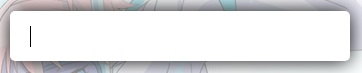

# 通用类
> 统一网站风格

## 默认样式
```
* {
    margin: 0;
    padding: 0;
    border: 0;
}

img, li {
    display: inline-block;
    float: left;
}

body {
    color: black;
    font: 16px/20px "Microsoft YaHei";
}

a {
    color: orange;
    text-decoration: none;
}

input, textarea, select {
    font: 16px/20px "Microsoft YaHei";
    outline: none;
}

.clear {
    display: block;
    clear: both;
}
```

## 确认框
```
function check(message) {
    if (confirm(message)) {
        return true;
    } else {
        location.reload();
        return false;
    }
}
```

## 控件

* 背景盒子




* 文本框





* 按钮


## 控件样式

```
.bg-box {
    border-radius: 10px;
    overflow: hidden;
}

.textbox {
    width: 300px;
    height: 50px;
    padding: 0 20px;
    border-radius: 5px;
}

.button {
    width: 100px;
    height: 50px;
    border-radius: 5px;
}
```

## 控件特效
> 外发光渐变，背景透明度渐变

```
$(document).ready(() => {
    shine($(".bg-box, .textbox, .button"), 10, 20);
    shadow($(".bg-box"), 255, 255, 255, 0.3, 0.5);
    shadow($(".button"), 255, 255, 255, 0.8, 1);
    select($(".textbox"), 255, 255, 255, 0.8, 1);
});

function shine(control, min, max) {
    control.css("box-shadow", "0 0 " + min + "px black");
    control.hover(function () {
        let light = min + 1;
        const flag = setInterval(() => {
            $(this).css("box-shadow", "0 0 " + light++ + "px black");
            if (light > max)
                clearInterval(flag);
        }, 10);
    }, function () {
        let light = max - 1;
        const flag = setInterval(() => {
            $(this).css("box-shadow", "0 0 " + light-- + "px black");
            if (light < min)
                clearInterval(flag);
        }, 10);
    });
}


function shadow(control, red, green, blue, min, max) {
    function rgba(a) {
        return "rgba(" + red + ", " + green + ", " + blue + ", " + a + ")"
    }
    const change = (max - min) / 9
    control.css("background-color", rgba(min));
    control.hover(function () {
        let a = min + change;
        const flag = setInterval(() => {
            $(this).css("background-color", rgba(a));
            a += change;
            if (a > max)
                clearInterval(flag);
        }, 10);
    }, function () {
            let a = max - change;
        const flag = setInterval(() => {
            $(this).css("background-color", rgba(a));
            a -= change;
            if (a < min)
                clearInterval(flag);
        }, 10);
    });
}

function select(control, red, green, blue, min, max) {
    function rgba(a) {
        return "rgba(" + red + ", " + green + ", " + blue + ", " + a + ")"
    }
    control.css("background-color", rgba(min));
    control.focus(() => {
        control.css("background-color", rgba(max));
    });
    control.blur(() => {
        control.css("background-color", rgba(min));
    });
}
```
