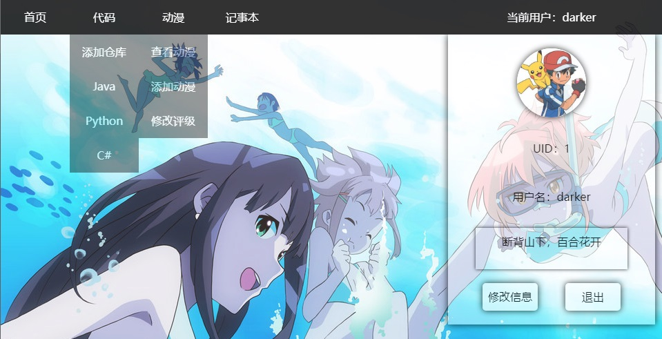
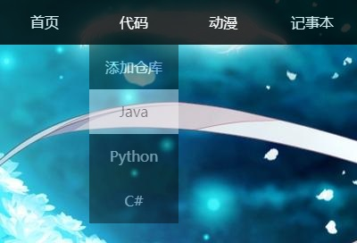
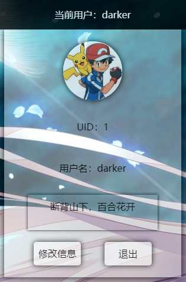
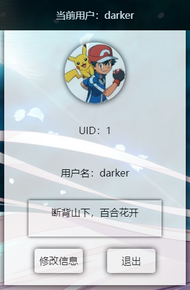

# 母版页



## 导航条



* 鼠标经过时显示下拉列表，改变背景和文字颜色
* 鼠标退出时隐藏下拉列表

---




* 鼠标经过时显示用户列表，移动到下拉列表时改变透明度
* 鼠标退出时隐藏用户列表

## 背景图片
> 背景图随机切换，淡入淡出

```
<div id="bg-box">
    <div id="bg-img"></div>
    <div id="bg-img-bak"></div>
</div>

window.onload = () => {
    const imgCount = 10;
    let index = Math.floor(Math.random() * imgCount);
    let last = index;
    document.getElementById("bg-img").style.background = "url('../Images/BGI/" + index + ".jpg')";
    function change() {
        do {
            index = Math.floor(Math.random() * imgCount);
        } while (index === last);
        last = index;
        gradual(index);
    }
    change();
    setInterval(() => change(), 5000);
}

function gradual(index) {
    let op1 = 100;
    let op2 = 0;
    const bgImg = document.getElementById("bg-img");
    const bgImgBak = document.getElementById("bg-img-bak");
    const flag = setInterval(() => {
        if (op1 > 0)
            bgImg.style.opacity = --op1 / 100;
        if (op1 < 50) {
            bgImgBak.style.background = "url('../Images/BGI/" + index + ".jpg')";
            bgImgBak.style.opacity = op2++ / 100;
        }
        if (op2 > 100 || document.hidden) {
            bgImg.style.background = "url('../Images/BGI/" + index + ".jpg')";
            bgImg.style.opacity = 1;
            bgImgBak.style.opacity = 0;
            clearInterval(flag);
        }
    }, 30)
}
```

## 显示用户

```
<div id="nav-user">
    当前用户：<asp:Literal ID="ltlUser" runat="server"></asp:Literal>
    <div id="nav-info">
        <div>
            <div id="nav-img" class="button"><asp:ImageButton ID="ibtnAvatar" runat="server" OnClick="IbtnAvatar_Click" Width="100" Height="100" /></div>
        </div>
        <div>UID：<asp:Literal ID="ltlUid" runat="server"></asp:Literal></div>
        <div>用户名：<asp:Literal ID="ltlName" runat="server"></asp:Literal></div>
        <div id="nav-motto"><asp:Literal ID="ltlMotto" runat="server"></asp:Literal></div>
        <div>
            <asp:Button ID="btnEdit" runat="server" OnClick="BtnEdit_Click" CssClass="button" />
            <asp:Button ID="btnExit" runat="server" OnClick="BtnExit_Click" CssClass="button" OnClientClick="return check('确认退出吗？');" />
            <div class="clear"></div>
        </div>
    </div>
</div>

protected void Page_Load(object sender, EventArgs e)
{
    if (!IsPostBack)
    {
        User user = (User)Session["User"];
        if (user == null)
        {
            HttpCookie cookie = Request.Cookies.Get("User");
            if (cookie == null)
                Response.Redirect("~/User/Login.aspx");
            user = new User()
            {
                LoginName = cookie["LoginName"],
                LoginPwd = cookie["LoginPwd"]
            };
            user = new UserService().UserLogin(user);
            if (user == null)
                Response.Redirect("~/User/Login.aspx");
            Session["User"] = user;
        }
        ltlUser.Text = user.LoginName;
        ibtnAvatar.ImageUrl = new UserService().LoadAvatar(user.UserId);
        ltlUid.Text = user.UserId.ToString();
        ltlName.Text = user.LoginName;
        ltlMotto.Text = user.Motto.ToString();
        btnEdit.Text = "修改信息";
        btnExit.Text = "退出";
    }
}
```

## 用户退出

```
protected void BtnExit_Click(object sender, EventArgs e)
{
    Response.Cookies["User"].Expires = DateTime.Now.AddDays(-1);
    Session.Abandon();
    Response.Redirect("~/User/Login.aspx");
}
```
