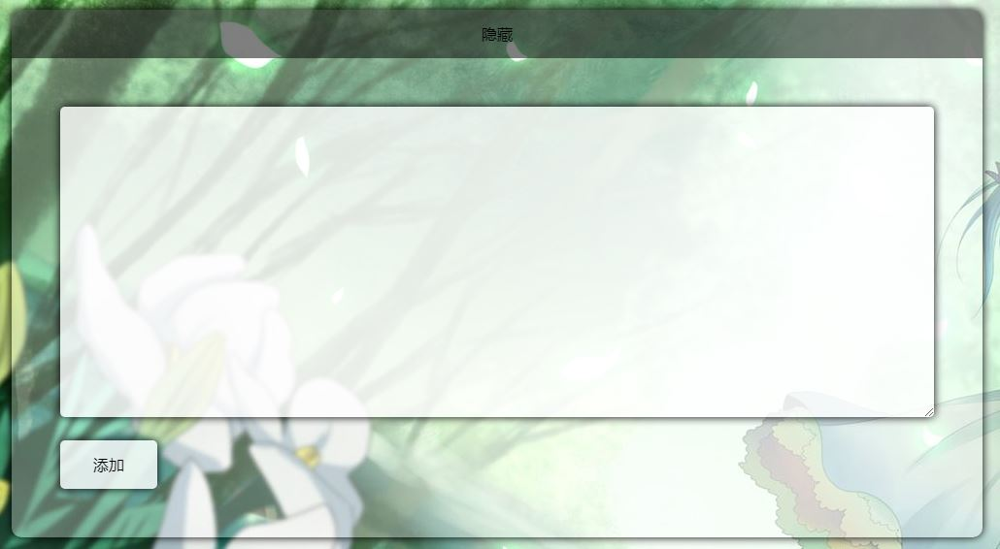
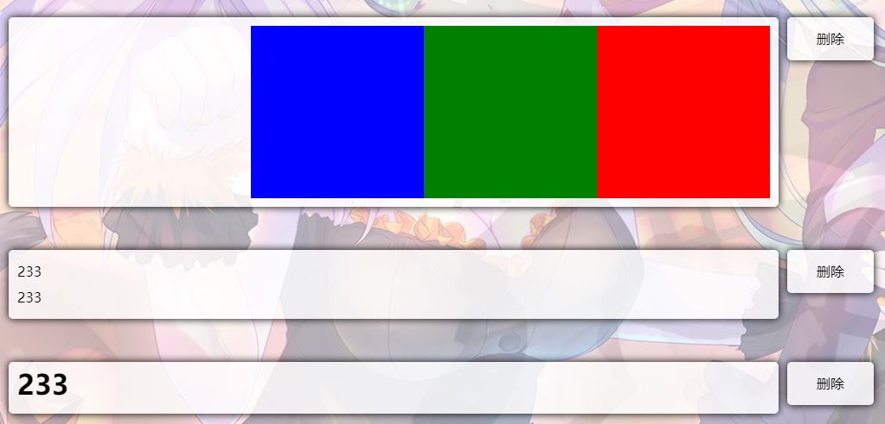

# 记事本

## 添加笔记




```
<%@ Page ValidateRequest="false" Title="" Language="C#" MasterPageFile="~/MainPage.Master" AutoEventWireup="true" CodeBehind="Note.aspx.cs" Inherits="FateSky.Note" %>

<div id="add-note" class="bg-box">
    <div id="add-note-control"></div>
    <div id="add-note-main">
        <div id="add-text"><asp:TextBox ID="txtText" CssClass="textbox" runat="server" TextMode="MultiLine"></asp:TextBox></div>
        <div id="add-btn"><asp:Button ID="btnAdd" CssClass="button" runat="server" Text="添加" OnClick="BtnAdd_Click" /></div>
    </div>
</div>

$(document).ready(() => {
    control = $("#add-note-control");
    main = $("#add-note-main");

    control.text("显示");
    main.css("display", "none");

    control.click(() => {
        main.slideToggle();
        control.text(control.text() == "隐藏" ? "显示" : "隐藏");
    });
});

protected void BtnAdd_Click(object sender, EventArgs e)
{
    string text = txtText.Text.Trim().Replace("\n", "").Replace("\r", "");
    int result = new NoteService().InsertNote(text);
    Response.Redirect("~/Note/Note.aspx?insert=" + result);
}
```

## 查看笔记



```
<asp:Repeater ID="rptNote" runat="server">
    <ItemTemplate>
        <div class="text">
            <div><asp:Button ID="btnDel" CssClass="button" runat="server" Text="删除" CommandArgument=<%#Eval("UpdateTime")%> OnClick="BtnDel_Click" /></div>
            <div class="textbox">
                <%#Eval("Text")%>
                <div class="clear"></div>
            </div>
        </div>
    </ItemTemplate>
</asp:Repeater>

protected void Page_Load(object sender, EventArgs e)
{
    if (!IsPostBack)
    {
        rptNote.DataSource = new NoteService().GetAllNotes();
        rptNote.DataBind();
        string message = null;
        if (Request.QueryString["insert"] == "1")
            message = "添加成功";
        else if (Request.QueryString["insert"] != null)
            message = "添加异常";
        else if (Request.QueryString["delete"] == "1")
            message = "删除成功";
        else if (Request.QueryString["delete"] != null)
            message = "删除异常";
        if (message != null)
        {
            ltlMsg.Text = "<script>alert('" + message + "')</script>";
            return;
        }
    }
    ltlMsg.Text = "";
}
```

## 删除笔记

```
protected void BtnDel_Click(object sender, EventArgs e)
{
    DateTime updateTime = Convert.ToDateTime(((Button)sender).CommandArgument);
    int result = new NoteService().DeleteNote(updateTime);
    Response.Redirect("~/Note/Note.aspx?delete=" + result);
}
```
