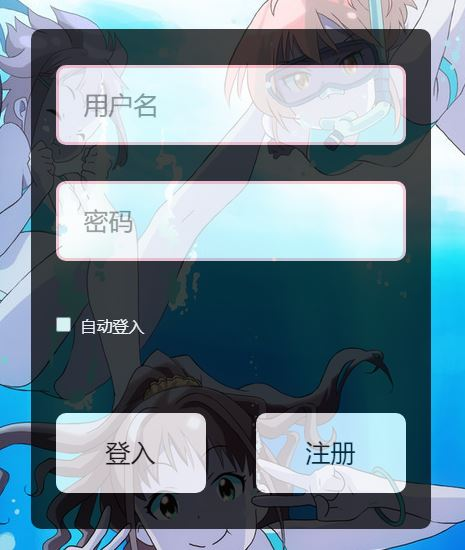
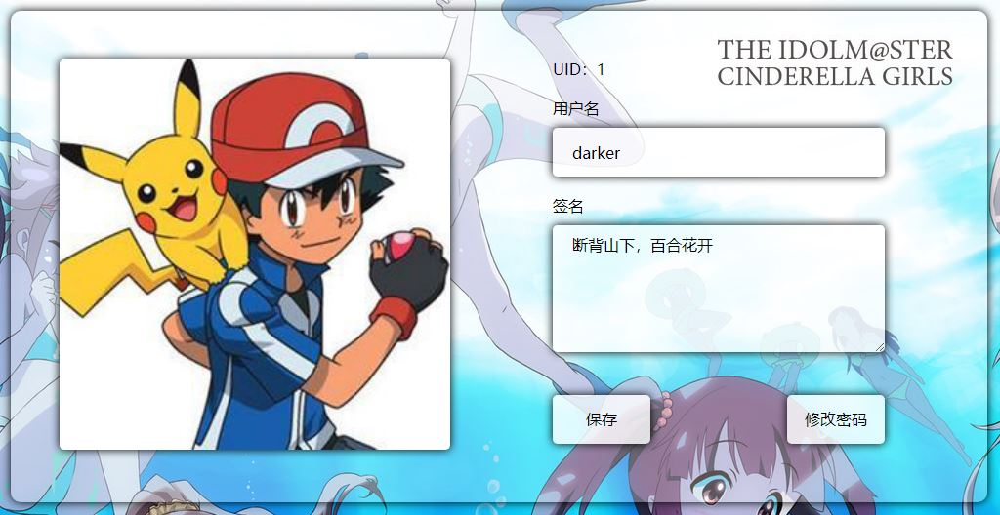
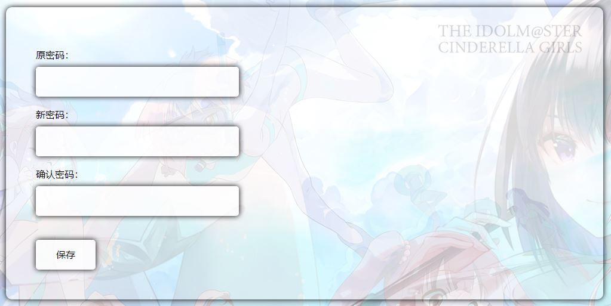
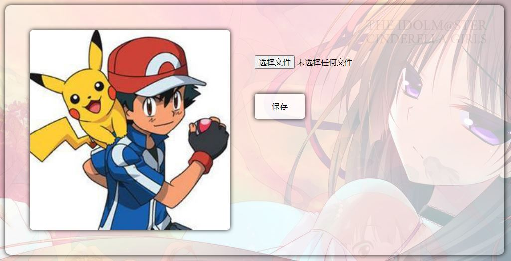

# 用户

## 登录
> 淡出渐变，向下渐变，控件特效



```
<asp:Literal ID="ltlMsg" runat="server"></asp:Literal>
<div id="login-box">
    <div><asp:TextBox ID="txtUser" runat="server"></asp:TextBox></div>
    <div><asp:TextBox ID="txtPwd" runat="server"></asp:TextBox></div>
    <div><asp:CheckBox ID="chkRem" runat="server" /></div>
    <div>
        <asp:Button ID="btnSignIn" runat="server" OnClick="BtnSignIn_Click" />
        <asp:Button ID="btnSignOut" runat="server" />
        <div class="clear"></div>
    </div>
</div>

window.onload = () => {
	let offset = 0;
    const loginBox = document.getElementById("login-box");
    const flag = setInterval(() => {
        loginBox.style.marginTop = -300 + offset++ + "px";
        loginBox.style.opacity = offset / 70;
        if (offset > 50) clearInterval(flag);
    }, 10);
}

$(document).ready(() => {
    const user = $("#txtUser");
    const pwd = $("#txtPwd");

    function defText(txt, pwd = false) {
        const def = "gray";
        const slc = "black"
        const str = txt.val();
        txt.css("color", def);
        txt.focus(() => {
            if (txt.val() == str) {
                txt.val("");
                txt.css("color", slc)
                if (pwd) txt.attr("type", "password");
            }
        });
        txt.blur(() => {
            if (txt.val() == "") {
                txt.val(str);
                txt.css("color", def)
                if (pwd) txt.attr("type", "text");
            }
        });
    }

    defText(user);
    defText(pwd, true);

    function light(txt, select, move) {
        if (select) {
            txt.css("border", "3px solid green");
            txt.css("box-shadow", "0 0 20px green");
        } else if (move) {
            txt.css("border", "3px solid blue");
        } else {
            txt.css("border", "3px solid pink");
            txt.css("box-shadow", "");
        }
    }

    function select(txt) {
        txt.width(txt.width() - 6);
        txt.height(txt.height() - 6);
        txt.css("border", "3px solid pink");
        txt.focus(() => light(txt, true, null));
        txt.blur(() => light(txt, false, false));
        txt.hover(() => {
            if (!txt.is(":focus")) light(txt, false, true);
        }, () => {
            if (!txt.is(":focus")) light(txt, false, false);
        });
    }

    select(user);
    select(pwd);

    function btnlight(btn) {
        btn.hover(() => {
            btn.css("box-shadow", "0 0 20px green");
        }, () => {
            btn.css("box-shadow", "");
        });
    }

    btnlight($("#btnSignIn"))
    btnlight($("#btnSignOut"))
});

protected void Page_Load(object sender, EventArgs e)
{
    if (!IsPostBack)
    {
        if (Session["User"] != null)
            Response.Redirect("~/Default.aspx");
        txtUser.Text = "用户名";
        txtPwd.Text = "密码";
        chkRem.Text = "自动登入";
        btnSignIn.Text = "登入";
        btnSignOut.Text = "注册";
    }
    ltlMsg.Text = "";
}

protected void BtnSignIn_Click(object sender, EventArgs e)
{
    string loginName = txtUser.Text.Trim().ToLower();
    string loginPwd = txtPwd.Text.Trim();
    txtUser.Text = "用户名";
    txtPwd.Text = "密码";
    if (loginName == "用户名" || loginPwd == "密码")
    {
        ltlMsg.Text = "<script>alert('用户名和密码不能为空!')</script>";
        return;
    }
    User user = new User()
    {
        LoginName = loginName,
        LoginPwd = loginPwd
    };
    user = new UserService().UserLogin(user);
    if (user != null)
    {
        if (chkRem.Checked)
        {
            HttpCookie cookie = new HttpCookie("User")
            {
                Expires = DateTime.Now.AddDays(1)
            };
            cookie.Values.Add("LoginName", user.LoginName);
            cookie.Values.Add("LoginPwd", user.LoginPwd);
            Response.Cookies.Add(cookie);
        }
        Session["User"] = user;
        Response.Redirect("~/Default.aspx");
    }
    ltlMsg.Text = "<script>alert('用户名或密码错误!')</script>";
}
```

## 修改信息



```
<asp:Literal ID="ltlMsg" runat="server"></asp:Literal>
<div id="main-user" class="bg-box">
    <div id="main-img">
        <asp:ImageButton ID="ibtnAvatar" runat="server" Width="400" Height="400" CssClass="button" OnClick="IbtnAvatar_Click" />
    </div>
    <div id="main-info">
        <div>UID：<asp:Literal ID="ltlUid" runat="server"></asp:Literal></div>
        <div>用户名<br /><asp:TextBox ID="txtName" runat="server" CssClass="textbox"></asp:TextBox></div>
        <div>签名<br /><asp:TextBox ID="txtMotto" runat="server" CssClass="textbox" TextMode="MultiLine"></asp:TextBox></div>
        <div>
            <asp:Button ID="btnSave" runat="server" Text="保存" OnClick="BtnSave_Click" CssClass="button" />
            <asp:Button ID="btnPwd" runat="server" Text="修改密码" OnClick="BtnPwd_Click" CssClass="button" />
        </div>
    </div>
    <div class="clear"></div>
</div>

protected void Page_Load(object sender, EventArgs e)
{
    if (!IsPostBack)
    {
        User user = (User)Session["User"];
        ibtnAvatar.ImageUrl = new UserService().LoadAvatar(user.UserId);
        ltlUid.Text = user.UserId.ToString();
        txtName.Text = user.LoginName;
        txtMotto.Text = user.Motto;
        if (Request.QueryString["modify"] == "1")
        {
            ltlMsg.Text = "<script>alert('修改成功')</script>";
            return;
        }
    }
    ltlMsg.Text = "";
}

protected void BtnSave_Click(object sender, EventArgs e)
{
    User user = (User)Session["User"];
    string loginName = txtName.Text.Trim();
    string motto = txtMotto.Text.Trim();
    if (loginName == user.LoginName && motto == user.Motto)
    {
        ltlMsg.Text = "<script>alert('未修改')</script>";
        return;
    }
    user.LoginName = loginName;
    user.Motto = motto;
    int result = new UserService().EditUser(user);
    if (result == 1)
    {
        HttpCookie cookie = Response.Cookies["User"];
        cookie["LoginName"] = user.LoginName;
        cookie["LoginPwd"] = user.LoginPwd;
        cookie.Expires = DateTime.Now.AddDays(1);
        Response.Redirect("~/User/EditUser.aspx?modify=1");
    }
    else
        ltlMsg.Text = "<script>alert('修改异常')</script>";
}

protected void BtnPwd_Click(object sender, EventArgs e)
{
    Response.Redirect("~/User/EditPwd.aspx");
}

protected void IbtnAvatar_Click(object sender, ImageClickEventArgs e)
{
    Response.Redirect("~/User/UpAvatar.aspx");
}
```

## 修改密码



```
<asp:Literal ID="ltlMsg" runat="server"></asp:Literal>
<div id="main-user" class="bg-box">
    <div id="main-img">
        <asp:ImageButton ID="ibtnAvatar" runat="server" Width="400" Height="400" CssClass="button" OnClick="IbtnAvatar_Click" />
    </div>
    <div id="main-info">
        <div>UID：<asp:Literal ID="ltlUid" runat="server"></asp:Literal></div>
        <div>用户名<br /><asp:TextBox ID="txtName" runat="server" CssClass="textbox"></asp:TextBox></div>
        <div>签名<br /><asp:TextBox ID="txtMotto" runat="server" CssClass="textbox" TextMode="MultiLine"></asp:TextBox></div>
        <div>
            <asp:Button ID="btnSave" runat="server" Text="保存" OnClick="BtnSave_Click" CssClass="button" />
            <asp:Button ID="btnPwd" runat="server" Text="修改密码" OnClick="BtnPwd_Click" CssClass="button" />
        </div>
    </div>
    <div class="clear"></div>
</div>

protected void Page_Load(object sender, EventArgs e)
{
    if (!IsPostBack)
    {
        User user = (User)Session["User"];
        ibtnAvatar.ImageUrl = new UserService().LoadAvatar(user.UserId);
        ltlUid.Text = user.UserId.ToString();
        txtName.Text = user.LoginName;
        txtMotto.Text = user.Motto;
    }
    ltlMsg.Text = "";
}

protected void BtnSave_Click(object sender, EventArgs e)
{
    User user = (User)Session["User"];
    string loginName = txtName.Text.Trim();
    string motto = txtMotto.Text.Trim();
    if (loginName == user.LoginName && motto == user.Motto)
    {
        ltlMsg.Text = "<script>alert('未修改')</script>";
        return;
    }
    user.LoginName = loginName;
    user.Motto = motto;
    int result = new UserService().EditUser(user);
    if (result == 1)
    {
        HttpCookie cookie = Response.Cookies["User"];
        cookie["LoginName"] = user.LoginName;
        cookie["LoginPwd"] = user.LoginPwd;
        cookie.Expires = DateTime.Now.AddDays(1);
        Response.Redirect(Request.Url.ToString());
    }
    else
        ltlMsg.Text = "<script>alert('修改异常')</script>";
}

protected void BtnPwd_Click(object sender, EventArgs e)
{
    Response.Redirect("~/User/EditPwd.aspx");
}

protected void IbtnAvatar_Click(object sender, ImageClickEventArgs e)
{
    Response.Redirect("~/User/UpAvatar.aspx");
}
```

## 修改头像



```
<asp:Literal ID="ltlMsg" runat="server"></asp:Literal>
<div id="main-avatar" class="bg-box">
    <div id="main-avatar-show">
        <asp:Image ID="imgAvatar" runat="server" Width="400" Height="400" CssClass="button" />
    </div>
    <div id="main-avatar-up">
        <asp:FileUpload ID="fupAvatar" runat="server" /><br />
        <asp:Button ID="btnSave" runat="server" Text="保存" CssClass="button" OnClick="BtnSave_Click" />
    </div>
    <div class="clear"></div>
</div>

protected void Page_Load(object sender, EventArgs e)
{
    if (!IsPostBack) {
        int userId = ((User)Session["User"]).UserId;
        string image = new UserService().LoadAvatar(userId);
        imgAvatar.ImageUrl = image;
    }
    ltlMsg.Text = "";
}

protected void BtnSave_Click(object sender, EventArgs e)
{
    if (!fupAvatar.HasFile)
    {
        ltlMsg.Text = "<script>alert('请选择文件')</script>";
        return;
    }
    string[] name = fupAvatar.FileName.Split('.');
    if (name[name.Length - 1].ToLower() != "jpg")
    {
        ltlMsg.Text = "<script>alert('图片必须jpg')</script>";
        return;
    }
    if (fupAvatar.FileContent.Length > 1024 * 1024)
    {
        ltlMsg.Text = "<script>alert('不能超过1M')</script>";
        return;
    }
    try
    {
        int userId = ((User)Session["User"]).UserId;
        Stream stream = fupAvatar.PostedFile.InputStream;
        int result = new UserService().SaveAvatar(userId, stream);
        if (result == 1)
            ltlMsg.Text = "<script>alert('保存成功')</script>";
        else
            throw new Exception("数据异常");
    }
    catch (Exception ex)
    {
        ltlMsg.Text = "<script>alert('图片上传失败\\n" + ex.Message + "')</script>";
    }
}
```
